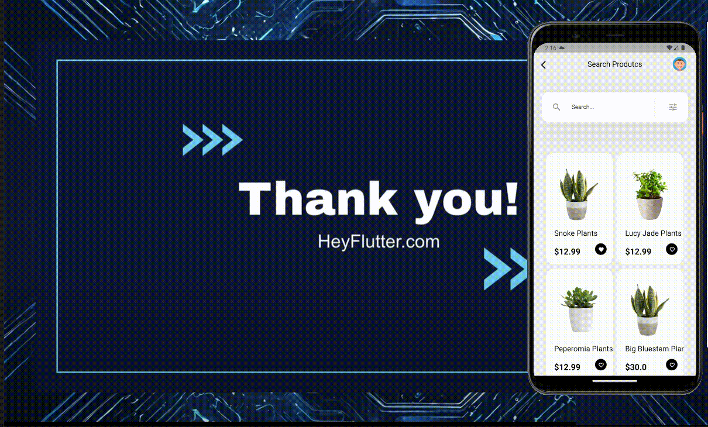

# ui_challenge
## HeyFlutter Desafio de codificação

👨 💻👩 💻 Estamos entusiasmados em anunciar o HeyFlutter "Coding Challenge",
uma oportunidade fantástica para mostrar suas habilidades Flutter e competir
para ganhar algumas recompensas incríveis. Neste Desafio de Codificação, 
você terá que criar essas telas 3x do "Plant UI design" no Flutter e 
enviá-lo até 21 de outubro.

👉 Basta assistir a este vídeo que explica esse desafio em detalhes:
https://lnkd.in/dfB-XEh5

👉 Para participar, basta preencher este Formulário do Google aqui:
https://lnkd.in/dvFMhCKU

Mais detalhes sobre este Desafio de Codificação abaixo

Data limite para submissão: 21 de outubro de 2023
Objetivo: Desenvolver um aplicativo de loja Flutter Plant semelhante ao modelo
de interface do usuário fornecido.
Recompensas: Shoutout na transmissão ao vivo, compartilhamento do perfil do
GitHub, feedback para o seu projeto

Link para o design da interface do usuário: 
https://lnkd.in/d6-jEC8V

### #flutter #programming #coding

    

